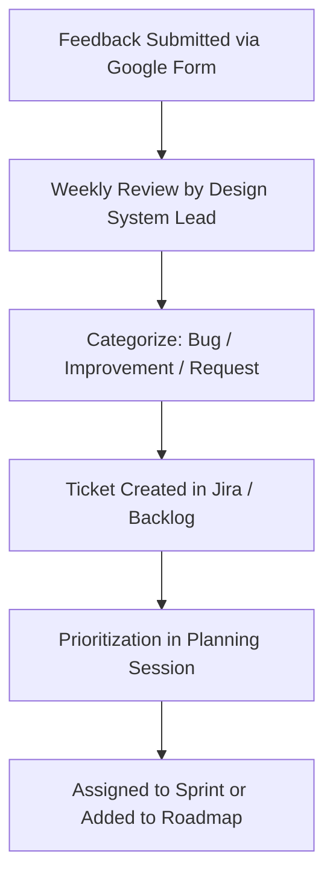

import { Meta, Markdown } from '@storybook/addon-docs/blocks';
import { version } from '../../../package.json';

<Meta title="Introduction/Feedback & Contribution" />

# 📝 Feedback & Contribution Guide

GridKit thrives on collaboration. This page outlines how anyone — designer, developer, QA, or product team — can submit feedback, suggest improvements, or help shape the evolution of our design system.

---

## 🎯 Purpose

We collect feedback to:

- Gather insights from designers, developers, QA, and product teams
- Identify bugs, UX issues, or missing components
- Prioritize improvements and future roadmap items
- Improve adoption and satisfaction across Grid Dynamics projects

---

## 📥 How to Submit Feedback

We use a simple feedback form:

👉 **[Submit Feedback Form](https://docs.google.com/forms/d/e/1FAIpQLSf07as96QmQiNRHzBnZ_CJVsNL2naHy4Dr355P_-qrc5JgMzQ/viewform?usp=dialog)**

Please include the following:

- Your team and role
- The component or token you're giving feedback about
- A brief description of the issue or suggestion
- _(Optional)_ Screenshot or context

---

## 🔁 Feedback Review Flow

---

## 🧭 Roles and Responsibilities

<Markdown>
{`
| Role               | Responsibility                                             |
|--------------------|----------------------------------------------------------|
| Submitter          | Reports feedback clearly using the form                   |
| Design System Lead | Reviews form submissions weekly                           |
| Tech Lead / Architect | Evaluates technical suggestions or concerns         |
| Designer           | Reviews any visual/UX-related issues or enhancements       |
| Product Owner      | Helps prioritize based on impact and usage                |
| Maintainer         | Creates/updates tickets and ensures implementation or reply|

`}

</Markdown>

## 📆 Review Schedule

- Form responses are reviewed **every Friday**

---

## ✅ What Happens After You Submit

- You may receive a follow-up (if contact provided)
- Your suggestion will be added to the backlog
- If accepted, it will be scheduled for development or refinement
- You’ll be notified when the change is released

---

📣 **Thank you for helping us make GridKit better for everyone!**

Made with ❤️ by Grid Dynamics · GridKit v{version}
